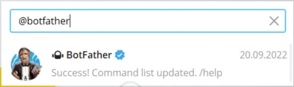
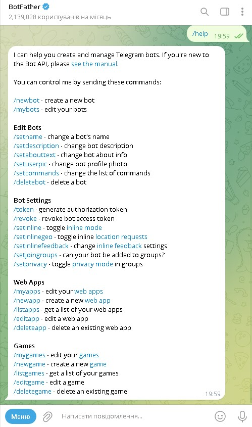
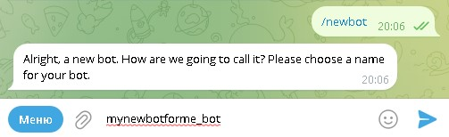
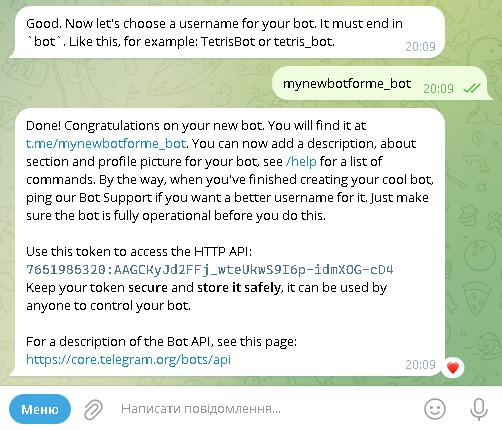

# Заняття 1 

### Знайомство з TelegramBotApi

### [&#8678; Зміст](../index.md)

---

### Вступ

**Для створення ботів доступні API в багатьох популярних месенджерах:**

1. WhatsApp
2. Telegram
3. Facebook Messenger
4. Discord

**Python API для створення ботів в Telegram:**

- API: pyTelegramBotAPI
  - Бібліотека: [pyTelegramBotAPI](https://pypi.org/project/pyTelegramBotAPI/)
- API: python-telegram-bot
  - Бібліотека: [python-telegram-bot](https://pypi.org/project/python-telegram-bot/)
- API: aiogram
  - Бібліотека: [aiogram](https://pypi.org/project/aiogram/)

Можливості: надсилання текстів, зображень, відео, інтерактивні кнопки, опитування, обробка команд.

### API

API, або Application Programming Interface (Інтерфейс програмування додатків), — це 
набір правил і протоколів, які дозволяють різним програмам взаємодіяти між собою. 
API визначає, як одна програма може звертатися до іншої програми або сервісу для 
отримання даних або виконання певних функцій.

Основні поняття про API:

- Інтерфейс:
  - API надає стандартизований спосіб для доступу до функціональності або даних іншої програми чи сервісу.
- Протоколи:
  - API часто використовують протоколи, такі як HTTP або HTTPS, для передачі даних між програмами.
- Методи:
  - API може включати різні методи або кінцеві точки (endpoints), що дозволяють виконувати різні дії, такі як GET для отримання даних, POST для надсилання нових даних, PUT для оновлення існуючих даних та DELETE для видалення даних.

API дозволяють інтегрувати різні сервіси та додатки, що значно спрощує розробку 
програмного забезпечення та розширення його функціональності.

### Створення бота

Щоб створити бота в Telegram: 

1. Відкрийте додаток Telegram

3. В рядку пошуку введіть __botfather__ 
 
   - 

3. За допомогою команди `/help` виведіть список основних команд

   - 

   - Як бачимо зі списку, нового бота можна створити за допомогою команди `/newbot`

   - Також можна скористатися кнопкою __меню__

4. Далі слід створити імя бота, а також унікальне імя для ідентифікацї вашиго бота яке обовязково має закінчуватися на __bot__
 
   - 

5. Якщо все пройшло добре то ви отримаєте повідомлення що ботa створено
   
   -  


### Python Bot

Встановлення бібліотеки: Відкрийте командний рядок або термінал і введіть наступну команду для встановлення бібліотеки:

```bash
pip install pyTelegramBotAPI
```

Бібліотека: [pyTelegramBotAPI](https://pypi.org/project/pyTelegramBotAPI/)

Імпортуйте необхідні модулі та створіть бота за допомогою токена, 
отриманого від BotFather.

```python
import telebot

# Замість 'YOUR_BOT_API_TOKEN' використайте свій API-токен, отриманий від BotFather
bot = telebot.TeleBot('YOUR_BOT_API_TOKEN')

# Код програми ...

# Запуск бота
bot.polling()
```

У бібліотеці pyTelegramBotAPI функція __message_handler__ 
використовується для обробки різних повідомлень від користувачів Telegram. 
Ця функція приймає кілька параметрів для визначення умов, 
за якими буде оброблятися повідомлення.

__content_types__: Типи контенту, який повинен оброблятися 
(наприклад, text, photo, document).

```python
@bot.message_handler(content_types=['text', 'photo']) 
def handle_content_type(message): 
    bot.reply_to(message, "Це текст або фото.")
```

__commands__: Список команд, які повинні оброблятися (наприклад, /start, /help).

```python
# Встановлення команди для обробки повідомлення (/start, /help)
@bot.message_handler(commands=['start', 'help'])
def send_welcome(message):    
    bot.reply_to(message, "Привіт! Як я можу допомогти?")
```

#### Telegram Bot

__Телеграм-бот__ — це програма, яка працює в месенджері Telegram і автоматично виконує певні дії чи відповідає на повідомлення користувачів. Боти можуть бути налаштовані для різних завдань, таких як:

- **Відповіді на команди:** Боти можуть обробляти спеціальні команди (наприклад, `/start`, `/help`) і виконувати певні дії у відповідь.
- **Розсилки:** Боти можуть надсилати повідомлення або новини підписникам.
- **Інтерактивні функції:** Боти можуть надавати інтерактивні можливості, такі як опитування, голосування, ігри тощо.
- **Інтеграція з сервісами:** Боти можуть працювати як інтерфейси для різних сервісів, наприклад, відстеження посилок, переклади, погода тощо.
- **Автоматизація:** Боти можуть виконувати автоматизовані завдання, такі як нагадування, планування подій, моніторинг даних тощо.

Боти створюються за допомогою API Telegram, що дозволяє розробникам програмувати їхню поведінку і функціональність. 

[Telegram Bot API](https://core.telegram.org/bots/api)


## Pythonanywhere

PythonAnywhere — це хмарний сервіс, який дозволяє запускати, 
тестувати та розробляти Python-програми без необхідності 
налаштування власного серверного середовища. 
Він надає зручний веб-інтерфейс для роботи з Python і багатофункціональне 
середовище для розробки додатків.

[Pythonanywhere](https://www.pythonanywhere.com/)

#### Основні функції PythonAnywhere:

- Веб-додатки: Ви можете швидко налаштувати та розгорнути веб-додатки з використанням Flask та інших фреймворків без необхідності налаштування серверів.

- Консоль Python: Доступ до інтерактивної консолі Python через веб-інтерфейс, де ви можете виконувати код, налагоджувати та тестувати свої програми.

- Сховища коду: Підтримка версійного контролю за допомогою Git та інших інструментів для керування вашим кодом.

- База даних: Вбудована підтримка різних баз даних, включаючи MySQL та PostgreSQL.

- Завдання Cron: Можливість автоматично виконувати завдання за розкладом з використанням планувальника завдань (cron).

- Файлова система: Зберігання та управління файлами безпосередньо з веб-інтерфейсу.